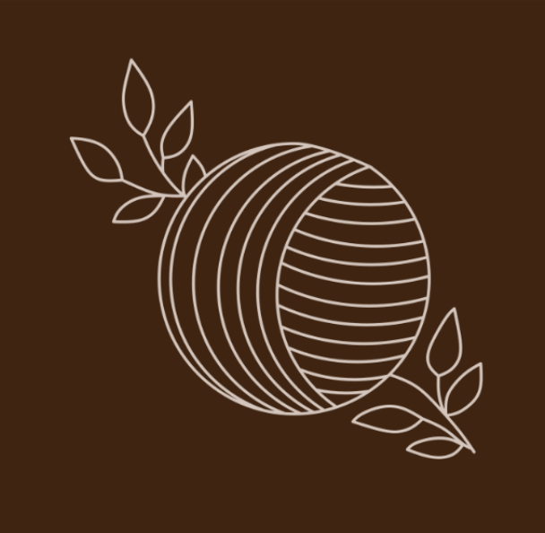

<div align="center">
    
    <h1>Lace</h1>
    
</div>

**Lace** is a **friendly, performant, data-oriented** interpreted programming language with **pragmatic functional programming.**

## Why Lace?

Lace is:
- **Data-oriented:** Seamless SIMD and cache-friendly data layouts
- **Gently FP:** Reliability without needing a PhD
- **Multi-target:** Compile to bytecode, JavaScript, or even C for extra speed!

## Installing Lace

In this phase of development, Lace is currently dependent on Rust's package manager (Cargo) to install. If you don't have Cargo, run:
```bash
curl --proto '=https' --tlsv1.2 -sSf https://sh.rustup.rs | sh
```
or visit https://rustup.rs

Are you back? Next, run:
```bash
cargo install laceup

# Install the toolchain
laceup install --default-toolchain

# Verify installation
lacec --version
knot --version
lacerun --version
```
to install the Lace Language Toolchain

## License

Lace is licensed under [Apache-2.0](LICENSE)
